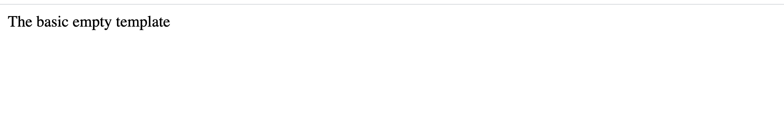

# PokeAPI-mirroring SPA
This is my solution to the below challenge that required building a small ReactJS app that pulls data from the PokeAPI and conditionally displays it.

<br>

## Setup

1. Make a fork of this repo
2. Clone your fork to your local development environment
3. Change to the project directory
4. Install dependencies: `yarn install`
5. Run the application: `yarn start`
6. Verify the application runs as expected

### What you should see



## Challenge
This challenge requires you to build a ReactJS app that... well... it just pulls data from the PokeAPI and shows it in HTML directly. Think back to those PokeAPI NodeJS and vanilla JS + HTML challenges -- the power of React lets you combine those into a single project!

So, here's what we need at an 'overview' level:

1. When you visit the root of the webpage (eg. localhost:3000 or "/"), it just shows the title '**Pokemon Viewer**'. You can add some instructions if you like. This is the home page.
2. Add a nav that displays on all pages and lets you switch between Home page and PokeList
 
   - Add a `Link` for 'Home' that links `to` '/' 
   - Add a `Link` for 'Poke List' that links `to` '/pokeList' 
   


3. When you vist "/pokeList" it should fetch a list of pokemon names and display them on the screen as links.
   - The page should have the title '**Pokemons**'. 
   - Use the pokeapi to get the list:
  ```
	fetch(`https://pokeapi.co/api/v2/pokemon`)
  ```

4. You should be able to click on each pokemon name, which will then take you to the dynamic pokemon route for that pokemon


5. When you visit the "/pokemon/:pokemonName" route (eg. localhost:3000/pokemon/pikachu), it will fetch the right data from the PokeAPI and show both the name & one sprite (image) of the Pokemon on the page in a nice H1 tag.


## Resources

- https://reactrouter.com/web/guides/quick-start
- https://reactrouter.com/web/api/Hooks/useparams
- https://reactrouter.com/web/api/Link
- https://reactrouter.com/web/api/Route

## Hints Worth Googling

- Install react-router-dom
- React router params
- Passing JS data to React render/return HTML blocks
- If you're going through the React functional component style:
  - React functional component async
  - React functional component fetch
  - React hooks (useState, useParams, useEffect)
- Conditional rendering in React
  - *Cool tip:* Any React component or "page" that relies on external data in its rendering will always have at least one "frame" or brief moment of time where it has no data to render. When that happens, it errors out & crashes. So you need to check if your data exists before rendering your content!

## Tests and Submitting

At any time you can run `yarn test` to see your progress. By default it will run in `watch` mode, and you will have to press `q` to quit. It will run the automated tests against your code and let you know what your progress is so far. Once you have all the tests passing, you can submit your challenge. To do this make sure you have committed your work:

1. From the project root `git add .` and add all the files changed in this folder
2. Commit these files to your repository `git commit -m "challenge completed"`
3. Make sure your working tree is clear `git status`
4. Push these files to your github repository (master or main branch) `git push origin master`
5. Log on to Github and visit your fork of this challenge.
6. Make a pull request to the main branch.
7. Wait and watch the final tests run, if you are successful it will automatically let your educators know you are finished.

## Example solution
An example solution can be found in the challenge-complete branch of this repository.